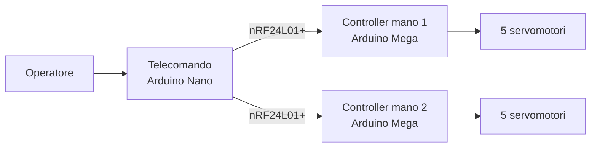
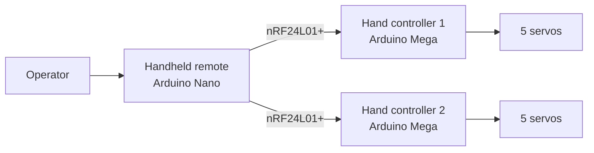

# Nato Due Volte — Scenic Robotic Hands Control System

<div align="center">


</div>

> 🇮🇹 [Italiano](#italiano) · 🇬🇧 [English](#english)

---

# Italiano

## Descrizione

**Nato Due Volte** è un carro carnevalesco presentato alla **73ª edizione del Carnevale di Massafra**. Questa repository documenta il sistema elettronico e firmware realizzato per controllare due **mani scenografiche robotizzate**, ciascuna dotata di cinque dita mosse indipendentemente da servomotori.

Il sistema utilizza un **telecomando palmare personalizzato** che comunica via radio con due unità di controllo indipendenti, una per mano. Ogni unità è basata su Arduino Mega 2560 e su una shield progettata su misura; il telecomando è basato su Arduino Nano con una propria shield dedicata.

## Stato e validazione

Questo progetto è stato **progettato, costruito, programmato, integrato e collaudato fisicamente** per l'impiego sul carro.

A differenza di altri repository presenti nel profilo, la progettazione elettronica, il firmware e l'integrazione sono stati svolti **prevalentemente direttamente dall'autore**, con un approccio hands-on. Il sistema è stato inoltre testato in condizioni operative reali.

Il progetto rappresenta quindi uno dei lavori più direttamente indicativi delle competenze pratiche dell'autore in elettronica embedded, PCB, integrazione hardware-software e collaudo.

## Obiettivi progettuali

I requisiti principali erano:

- controllo indipendente di due mani;
- cinque servomotori per mano;
- comando wireless affidabile;
- interfaccia semplice per un operatore non tecnico;
- installazione e manutenzione semplici durante l'allestimento del carro;
- alimentazione separata e adeguata al carico dei servomotori;
- possibilità di selezionare più sequenze/movimenti per ciascuna mano.

## Architettura



Il telecomando consente di inviare fino a **7 comandi di movimento** a ciascuna mano mediante combinazioni di pulsanti.

## Hardware

| Componente | Quantità | Funzione |
|---|---:|---|
| Arduino Mega 2560 | 2 | Unità di controllo delle mani |
| Arduino Nano | 1 | Telecomando |
| nRF24L01+ | 3 | Comunicazione radio |
| Shield personalizzata Mega | 2 | RF, connettori e distribuzione segnali |
| Shield personalizzata Nano | 1 | Pulsanti e modulo RF |
| Servomotori | 10 | Attuazione delle dita |
| Alimentatore 5 V / min. 8 A | 2 | Alimentazione delle mani |
| Powerbank 5 V | 1 | Alimentazione telecomando |

### Collegamento servomotori

| Connettore | Indice firmware | Dito |
|---|---:|---|
| J3 | 0 | Pollice |
| J4 | 1 | Indice |
| J5 | 2 | Medio |
| J6 | 3 | Anulare |
| J7 | 4 | Mignolo |

## Repository

```text
nato-due-volte/
├── controller_code.ino
├── code_telecomando.ino
└── manuale_di_installazione.docx
```

## Installazione firmware

Prerequisiti:

- Arduino IDE;
- libreria RF24.

Per ogni Arduino Mega, impostare `USE_FIRST` in modo coerente con il controller da programmare, quindi caricare `controller_code.ino`. Caricare `code_telecomando.ino` sull'Arduino Nano.

> Caricare entrambe le unità con la stessa configurazione può far rispondere entrambe le mani allo stesso comando.

Per cablaggio, alimentazione e troubleshooting fare riferimento al manuale di installazione.

## Demo

I video `natoduevolte.mp4` e `mano.mp4` mostrano il sistema fisico in funzione.

---

# English

## Project description

**Nato Due Volte** (*Born Twice*) was a carnival float presented at the **73rd edition of the Carnevale di Massafra**. This repository documents the electronics and firmware built to control two **scenic robotic hands**, each with five independently actuated servo-driven fingers.

A custom handheld remote communicates by RF with two independent control units, one for each hand. Each hand controller uses an Arduino Mega 2560 and a custom shield, while the remote uses an Arduino Nano with its own custom shield.

## Status and validation

This project was **designed, built, programmed, integrated, and physically tested** for use on the float.

Unlike some other repositories in this profile, the electronics design, firmware implementation, and system integration were performed **primarily directly by the author** through a hands-on development process. The finished system was tested in real operating conditions.

For that reason, this repository is one of the most representative examples of the author's practical work in embedded electronics, PCB design, hardware-software integration, and field testing.

## Design requirements

The main requirements were:

- independent control of two hands;
- five servos per hand;
- reliable wireless operation;
- simple interaction for a non-technical operator;
- straightforward installation and maintenance;
- adequate power delivery for the servo load;
- multiple selectable motion commands for each hand.

## Architecture



The remote can send up to **7 motion commands** to each hand through button combinations.

## Hardware

| Component | Qty | Purpose |
|---|---:|---|
| Arduino Mega 2560 | 2 | Hand control units |
| Arduino Nano | 1 | Handheld remote |
| nRF24L01+ | 3 | RF communication |
| Custom Mega shield | 2 | RF and servo interfacing |
| Custom Nano shield | 1 | Buttons and RF interface |
| Servo motors | 10 | Finger actuation |
| 5 V / min. 8 A PSU | 2 | Hand power supply |
| 5 V power bank | 1 | Remote power supply |

## Repository structure

```text
nato-due-volte/
├── controller_code.ino
├── code_telecomando.ino
└── manuale_di_installazione.docx
```

## Firmware installation

Requirements:

- Arduino IDE;
- RF24 library.

Configure `USE_FIRST` appropriately for each Mega controller before uploading `controller_code.ino`. Upload `code_telecomando.ino` to the Arduino Nano.

For wiring, power-supply details, and troubleshooting, see the installation manual.

## Demo

The files `natoduevolte.mp4` and `mano.mp4` show the physical system in operation.

## License

MIT License. See `LICENSE`.
